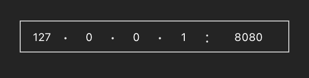

# IpInput 一个IP地址输入框


### 预览效果



### 安装

```sh
npm install ip-input-vue3 --save
```

### 使用

```js
import IpInput from 'ip-input-vue3'
import "ip-input-vue3/dist/IpInput.css"

const ipAddr = reactive({
  ip: "127.0.0.1",
  port: 8080
})
```

```html
<ip-input v-model:ip="ipAddr.ip" v-model:port="ipAddr.port"/>
```


